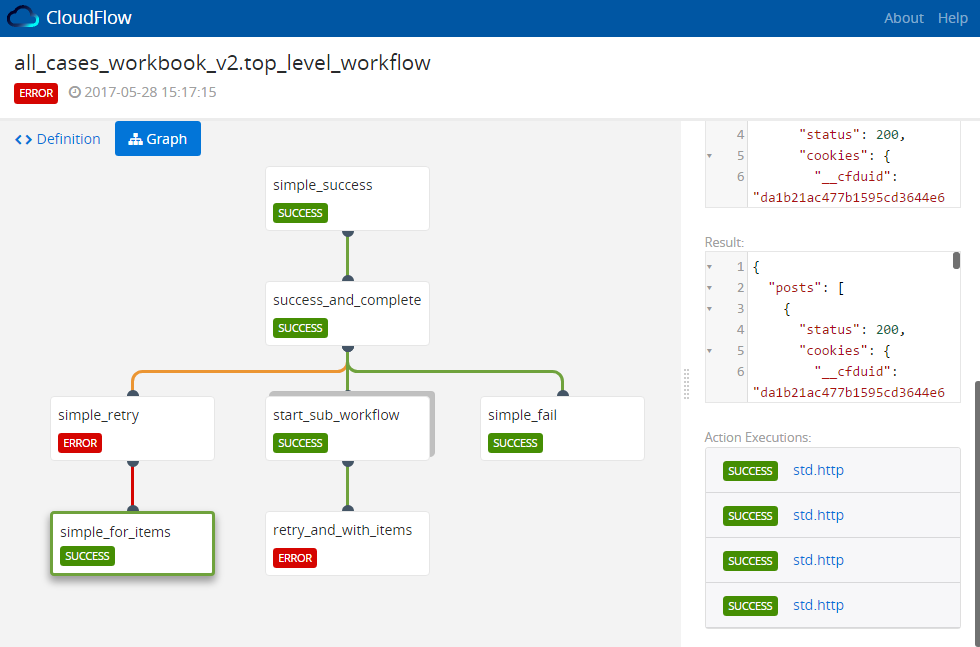

# CloudFlow
A workflow visualization tool for [OpenStack Mistral](https://github.com/openstack/mistral)

## Live Demo
[See CloudFlow in action](http://yaqluator.com:8000)

## Features
* Visualize the flow of workflow executions
* Identify the execution path of a single task in huge workflows
* Search by any entity ID
* Identify long-running tasks at a glance
* Easily distinguish between simple task (an action) and a sub workflow
  execution
* Follow tasks with a `retry` and/or `with-items`
* 1-click to copy task's input/output/publish/params values
* See complete workflow definition and per task definition YAML
* And more...

## Table of Contents
* [Requirements](#requirements)
* [Installation](#installing-cloudflow-on-the-mistral-machine)
* [Docker Installation](#docker-installation)
* [Upgrading](#upgrade-cloudflow)
* [Authentication](#authentication)
* [Development and Building](#development)

## Requirements

### Mistral >= Pike
CloudFlow requires Mistral **Pike** or greater, as we rely on
new [runtime_context](https://docs.openstack.org/developer/mistral/developer/webapi/v2.html#tasks)
added to Mistral Pike.

| Mistral Version  | CloudFlow Version to use                                        |
|------------------|-----------------------------------------------------------------|
| Stein (or newer) | Latest stable                                                   |
| Pike - Rocky     | [0.6.4](https://github.com/nokia/CloudFlow/releases/tag/v0.6.4) |

    
## Installing CloudFlow on the Mistral machine
CloudFlow has no dedicated backend service and passes the API calls to Mistral
via Proxy settings.

In the [`scripts`](scripts/) folder there are 2 configuration files: one for
when using **nginx** and one for **apache**.

To run CloudFlow on your Mistral instance:
1. Go to [releases](https://github.com/nokia/CloudFlow/releases) tab and
   download the latest release. Extract into a known location (i.e. `/opt`) so
   you'll have a `/opt/CloudFlow/` folder.
   * There will be 2 folders in there: `dist` which holds the UI application,
     and `scripts` for the various web servers options.
2. Copy the appropriate configuration file to the configuration directory on
   your Mistral machine:
   * nginx: usually: `/etc/nginx/conf.d/http/servers/`
   * Apache2:
      * Linux: `/etc/apache2/sites-enabled/`.
      * Mac: `/etc/apache2/other/`. Also make sure that the environment
        variable APACHE_LOG_DIR is set to the proper value. On Mac computers
        it's usually `/var/log/apache2`.
      * Note that for apache2 several modules need to be enabled. See
           file for more info.
3. Optionally update the path in the configuration file(s) to point to the
  `dist` folder (i.e. `/opt/CloudFlow/dist`)
4. Optionally update the port for which CloudFlow will be served in the browser
  (currently: 8000)
5. Optionally enable HTTPS in the configuration file.
6. Restart nginx/apache.
7. Open the browser and navigate to `http[s]://<your_mistral_ip>:8000`.

## Docker Installation

This image based on multi-stage build. The first layer is used to create a artifacts.
The second layer is the nginx alpine image.

### Build docker image

```bash
docker build -t cloud-flow .
```

### Start docker container

* without SSL
```bash
docker run -d --rm --net=host --name cloud-flow cloud-flow
```

* using SSL

Generate certificates, for example
```bash
mkdir certs
cd certs
sudo openssl req -x509 -nodes -days 365 -newkey rsa:2048 -keyout nginx.key -out nginx.crt
```
Run container
```bash
docker run --rm -d --net host --name cloud-flow \
       -v _absolute_path_/CloudFlow/certs:/etc/nginx/ssl:ro -e CF_SSL=ssl cloud-flow
```

### Environment variables for Docker container


|Name|Values|Default|Description|
|---|---|---|---|
|CF_PORT|Any number from 1 to 65535|8000|Port of the application|
|CF_SERVER_NAME|Names, wildcard names, or regular expressions|localhost|[Read more](https://nginx.ru/en/docs/http/server_names.html)|
|CF_MISTRAL_URL|URL|http://127.0.0.1:8989|URL to the Mistral server|
|CF_SSL|`ssl` or *empty value*|*empty value*|If the value equals `ssl` then server will use HTTPS connection instead HTTP|

## Upgrade CloudFlow
Whenever there is an update to CloudFlow, simply download the latest version's .tar.gz
  and extract it in the same place.
```bash
wget -qO- https://github.com/nokia/CloudFlow/releases/download/<version>/CloudFlow.tar.gz | tar xvz -C /opt
```

## Authentication
### OpenID Connect
CloudFlow supports the [OpenID Connect](http://openid.net/connect/) protocol
(and was tested against [KeyCloak](http://www.keycloak.org/)).

If your Mistral requires authentication and uses the OpenID Connect protocol,
create the following `auth.json` file under the `assets/` folder (i.e. `assets/auth.json`):

```json
{
  "_type": "openid-connect",
  "issuer": "<Url of the Identity Provider>",
  "loginUrl": "<Url for login endpoint>",
  "logoutUrl": "<Url for logout endpoint, optional>",
  "clientId": "<Client Identifier valid at the Authorization Server>"
}
```

You can obtain all the URLs by examining the output of `https://<openid-server-ip>:<port>/auth/realms/<realm>/.well-known/openid-configuration`

#### Cross Domain Access Token Sharing

Redirecting from different applications to the CloudFlow. 
CloudFlow supports reading `access_token` form authenticated application opened in another tab with the same browser without passing the `access_token` in the URL. 

The authenticated application should allow that by adding the following: 

Adding [cross-domain-storage](https://github.com/MatthewLarner/cross-domain-storage) dependency in the host application: 
 ```Javascript
 import createHost from 'cross-domain-storage/host';
 createHost([{
   origin: 'CloudFlow URL',
   allowedMethods: ['get']
  }]);
```

### No Authentication 
If you want to work w/o authentication, make sure your Mistral does not require authentication to perform REST API
requests, by setting the following in `/etc/mistral/mistral.conf`:

```
[pecan]
auth_enable=False
```

Also, make sure there is **no** `auth.json` file under the `assets/` directory.

## Development
* Clone this repo
* `yarn install` (preferred) or `npm install`
* Edit [`proxy.conf.json`](proxy.conf.json) to point your Mistral instance.
* Edit the `auth.json` file (if needed)
* `npm run start`

## Building
* Clone this repo
* `yarn install` (preferred) or `npm install`
* `npm run build`
* The artifacts will be stored in `dist` folder.



